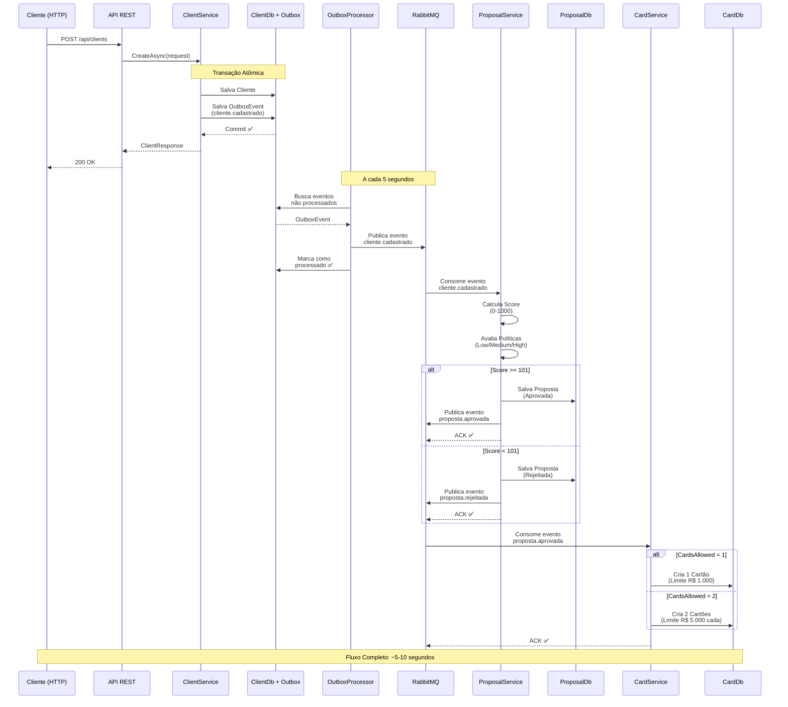
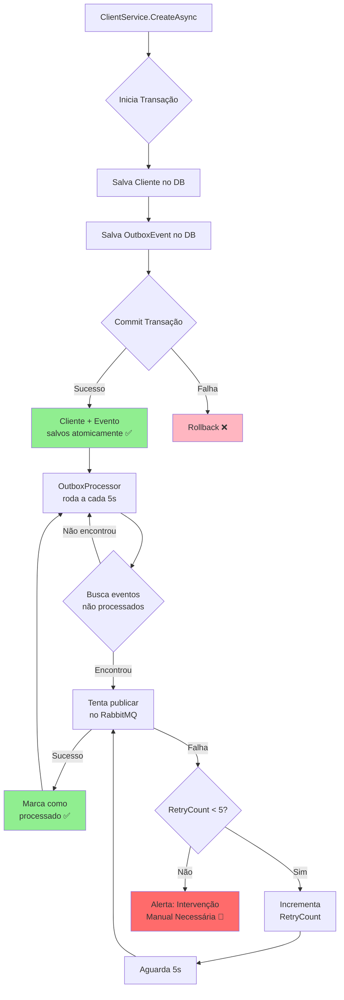

# Sistema de Crédito - Desafio Técnico
Repositório referente a desafio do Paraná Banco, e cujo objetivo era avaliar minhas habilidades técnicas como pessoa candidata à vaga de Backend e capacidade de resolver problemas de forma eficiente e clara.

O desafio proposto foi de implementação de um cadastro de clientes, análise de propostas de crédito e emissão de cartões com **resiliência** através do **Outbox Pattern**.


## 📋 Índice

- [Sobre o Projeto](#-sobre-o-projeto)
- [Tecnologias Utilizadas](#%EF%B8%8F-tecnologias-utilizadas)
- [Arquitetura](#%EF%B8%8F-arquitetura)
- [Fluxograma](#-fluxograma)
- [Pré-requisitos](#-pré-requisitos)
- [Como Executar](#-como-executar)
- [Endpoints da API](#endpoints-da-api)
- [Testes](#-testes)

## 🎯 Sobre o Projeto

Sistema desenvolvido para gerenciar o ciclo completo de crédito:

1. **Cadastro de Clientes** via API REST
2. **Análise de Proposta de Crédito** com cálculo de score automatizado
3. **Emissão de Cartões de Crédito** baseado na aprovação da proposta

### Características Principais

✅ **Arquitetura Modular** - Separação clara de responsabilidades  
✅ **Mensageria Assíncrona** - Comunicação via RabbitMQ  
✅ **Outbox Pattern** - Garantia de entrega de mensagens  
✅ **Resiliência** - Retry com backoff exponencial e Circuit Breaker  
✅ **Testes Unitários** - Cobertura com xUnit, NSubstiture e FluentAssertions  
✅ **Docker** - Containerização completa da aplicação


## 🛠️ Tecnologias Utilizadas

### Backend
- **.NET 8.0** - Framework principal
- **ASP.NET Core** - API REST
- **Entity Framework Core 9.0** - ORM (InMemory Database)
- **RabbitMQ.Client 7.0** - Cliente RabbitMQ
- **Polly 8.5** - Resiliência (Retry, Circuit Breaker)

### Mensageria
- **RabbitMQ 3.13** - Message Broker
- **Exchange Topic** - Roteamento de mensagens
- **Dead-Letter Queues** - Tratamento de falhas

### Testes
- **xUnit 2.9** - Framework de testes
- **NSubstitute 5.3.0** - Mock de dependências
- **FluentAssertions 7.0** - Assertions fluentes

### DevOps
- **Docker** - Containerização
- **Docker Compose** - Orquestração


## 🏗️ Arquitetura

A arquitetura escolhida foi o **Monolito Modular**. Embora a aplicação seja implantada como um único serviço (monolito), ela é internamente dividida em módulos lógicos independentes, cada um com sua própria responsabilidade, banco de dados (in-memory) e serviços. Isso oferece um bom equilíbrio entre a simplicidade de implantação de um monolito e a organização de microsserviços.

```
           ┌─────────────────┐
           │   API Gateway   │
           │   (ASP.NET 8)   │
           └────────┬────────┘
                    │
    ┌─────────┬─────┴──────┬────────────┐
    │         │            │            │
┌───▼───┐ ┌───▼────┐ ┌─────▼─────┐ ┌────▼───┐
│Client │ │Proposal│ │CreditCard │ │RabbitMQ│
│Module │ │Module  │ │Module     │ │        │
└───┬───┘ └──┬─────┘ └──────┬────┘ └─────┬──┘
    │        │              │            │
    └────────┴──────────────┴────────────┘
         Shared (Mensageria + Outbox)
```

### Módulos

| Módulo | Responsabilidade | Eventos Publicados |
|--------|------------------|-------------------|
| **Client** | Cadastro e gestão de clientes | `cliente.cadastrado` |
| **Proposal** | Análise de crédito e cálculo de score | `proposta.aprovada`, `proposta.rejeitada` |
| **CreditCard** | Emissão e gestão de cartões | N/A |

### Estrutura do projeto

```
├── docs/                                                  # Documentação e fluxograma
├── src/
│   ├── BuildingBlocks/
│   │   └── Challenge.Credit.System.Shared/                # Lógica compartilhada (eventos, mensageria, resiliência)
│   └── Services/       
│       ├── Challenge.Credit.System.Api/                   # Projeto principal (API, etc.)
│       ├── Challenge.Credit.System.Module.Client/         # Módulo de Cadastro de Clientes
│       ├── Challenge.Credit.System.Module.CreditProposal/ # Módulo de Proposta de Crédito
│       └── Challenge.Credit.System.Module.CreditCard/     # Módulo de Emissão de Cartões
├── tests/
│   ├── Challenge.Credit.System.Module.Client.Tests/         # Testes para o módulo de Cadastro
│   ├── Challenge.Credit.System.Module.CreditProposal.Tests/ # Testes para o módulo de Proposta
│   ├── Challenge.Credit.System.Module.CreditCard.Tests/     # Testes para o módulo de Cartão
│   └── Challenge.Credit.System.Shared.Tests
├── .gitignore
├── Challenge.Credit.System.sln
├── docker-compose.yml
└── README.md
```


### Decisões de Design

| Decisão | Justificativa |
| :--- | :--- |
| **Arquitetura Monolito Modular** | Escolhida para simplificar o deploy e a infraestrutura, mantendo a organização e o baixo acoplamento dos microsserviços. É um bom ponto de partida antes de evoluir para microsserviços distribuídos. |
| **Banco de Dados In-Memory** | Utilizado para facilitar a execução e os testes, eliminando a necessidade de um servidor de banco de dados externo. Cada módulo tem seu próprio `DbContext` para simular a separação de dados. |
| **Outbox Pattern** | Garante que **nenhum evento seja perdido**, mesmo se o RabbitMQ estiver fora do ar. Com um background service que processa eventos a cada 5s até 5 tentativas com backoff exponencial. |
| **Resiliência com Polly e Dead-Letter Queues** | A combinação do Polly (para retries e circuit breaker) com as DLQs do RabbitMQ para se recuperar de falhas temporárias e isolar mensagens problemáticas para análise posterior. |
| **Padrão de Resposta da API (Result Pattern)** | Padroniza todas as respostas da API, facilitando o consumo pelo cliente e o tratamento de sucessos e erros de forma consistente. |
| **Testes Unitários com xUnit, NSubstitute e FluentAssertions** | Fornece uma suíte de testes robusta e legível, garantindo a qualidade e a manutenibilidade do código. |


## 📊 Fluxograma

### Fluxo Completo: Cadastro → Proposta → Emissão de Cartão



### Fluxo de Resiliência (Outbox Pattern)




## 📦 Pré-requisitos

- [Docker](https://docs.docker.com/get-docker/) 20.10+
- [Docker Compose](https://docs.docker.com/compose/install/) 2.0+


## 🚀 Como Executar

Abra o seu prompt de comando e execute:

#### 1. Clone o repositório

```bash
git clone <url-do-repositorio>
```

#### 2. Execute com Docker Compose

```bash
docker-compose up --build
```

#### 3. Aguarde a inicialização

```
✅ RabbitMQ: http://localhost:15672 (guest/guest)
✅ API: http://localhost:8080
✅ Swagger: http://localhost:8080/swagger
```

#### 4. Verifique os logs

```bash
# Ver logs da API
docker-compose logs -f api

# Ver logs do RabbitMQ
docker-compose logs -f rabbitmq
```

#### 5. Parar os serviços

```bash
docker-compose down
```

---

## Endpoints da API

A documentação completa dos endpoints está disponível via Swagger em `http://localhost:8080/swagger`.

### Cadastro

*   `POST /api/clientes`: Cadastra um novo cliente.
*   `GET /api/clientes/{id}`: Obtém um cliente por ID.
*   `GET /api/clientes`: Lista todos os clientes.

### Proposta

*   `GET /api/propostas/{id}`: Obtém uma proposta por ID.
*   `GET /api/propostas/cliente/{clienteId}`: Lista todas as propostas de um cliente.

### Cartão

*   `GET /api/cartoes/cliente/{clienteId}`: Lista todos os cartões de um cliente.
*   `GET /api/cartoes/{id}`: Obtém um cartão por ID.


## 🧪 Testes

Os testes unitários foram criados com **xUnit** e cobrem as principais regras de negócio e serviços de cada módulo. Para executar os testes, utilize o seguinte comando na raiz do projeto:

### Executar Testes Unitários

```bash
# Todos os testes
dotnet test

# Em apenas um módulo (exemplo)
dotnet test tests/Challenge.Credit.System.Module.Client.Tests
```


## 👥 Autor

Desenvolvido como parte de um desafio técnico para demonstrar conhecimentos em:

- Arquitetura de Microsserviços
- Mensageria com RabbitMQ
- Padrões de Resiliência (Outbox, Retry, Circuit Breaker)
- Testes Unitários
- Docker e Containerização


## 📄 Licença

Este projeto foi desenvolvido para fins educacionais e de avaliação técnica.
